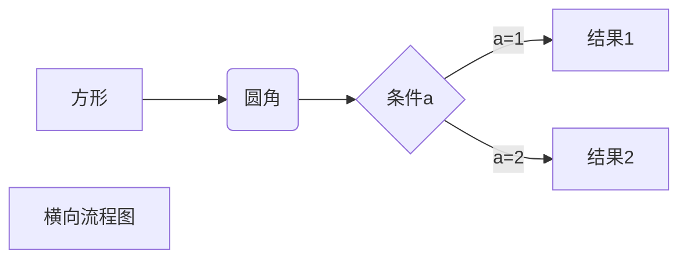
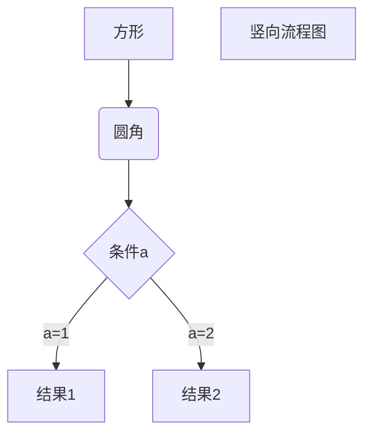
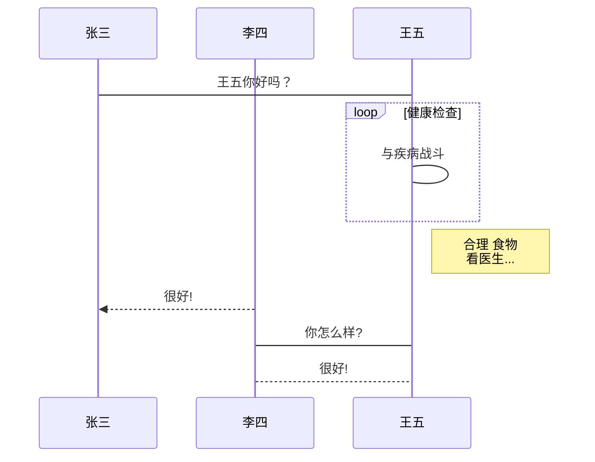
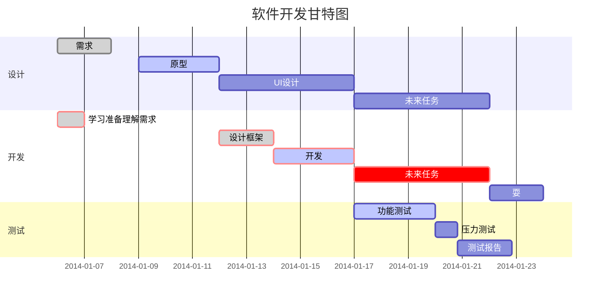

#  Markdown学习笔记

[TOC]

## 一、标题

# 一级标题

## 二级标题

###### 六级标题

## 二、段落

this is a test.

this is a test.

this is a test.  

this is a test.

## 三、字体

*这是斜体*

_这是斜体_

**这是粗体**

__这是粗体__

***这是粗斜体***

___这是粗斜体___

## 四、分隔线（+++、---、***）

+++

---

***

## 五、删除线（~~内容~~）

~~删除线展示~~

## 六、下划线（使用html中的<u>下划线</u>表示）

<u>下划线展示</u>

## 七、脚注（这里有一个[^脚注]）

[^脚注]:这里写脚注的内容

## 八、列表

### 无序列表

* 第一项
* 第二项
* 第三项


* 第一项
* 第二项
* 第三项

### 有序列表

1. 第一项
2. 第二项
3. 第三项

### 列表嵌套

1. 第一项
       1. 第一项第一个
          2. 第一项第二个
2. 第二项
   1. 第二项第一个
   2. 第二项第二个

## 九、 Markdown区块

###  区块嵌套

> 这是最外层
>
> > 这个第二层
> > > 这是第三层
> > >
> > > 这里是内容

### 区块中使用列表

> + 第一项
> + 第二项
> + 第三项

> 1. 第一项
> 2. 第二项
> 3. 第三项

### 列表中使用区块

* 第一项

    > Java
    >
    > MySQL
    >
    > Html
* 第二项
    > 语文
    > 数学
    > 英语

## 十、Markdown代码

#### 行内方法

~~~markdown
`printf()`方法
~~~

Java中可以调用  `System.out.println()`  方法进行控制台输出

#### 代码块

~~~java
public class Person{
    private int age;
    private String name;
    public Person(){
    }
}
~~~


## 十一、Markdown 链接

#### 基本链接

~~~markdown
[链接名称](链接地址)
或者
<链接地址>
~~~

[百度](http://www.baidu.com)

<http://www.baidu.com>

#### 高级链接

~~~markdown
这个链接用 1 作为网址变量[百度][1]
这个链接用 baidu 作为网址变量[百度][baidu]
~~~
这是一个网站[^百度]

[1]: http://www.baidu.com
[baidu]: http://www.baidu.com

[^百度]: 一个傻子网站


## 十二、Markdown 图片

图片语法格式

~~~markdown


~~~


这是一个图片[这是一个图片][picPath]

[picpath]:http://static.runoob.com/images/runoob-logo.png


使用 `img` 标签引入：


## 十三、Markdown表格

```markdown
|  表头   | 表头  |
|  ----  | ----  |
| 单元格  | 单元格 |
| 单元格  | 单元格 |
```

|  表头   | 表头  |
|  ----  | ----  |
| 单元格  | 单元格 |
| 单元格  | 单元格 |


```markdown
| 左对齐 | 右对齐 | 居中对齐 |
| :-----| ----: | :----: |
| 单元格 | 单元格 | 单元格 |
| 单元格 | 单元格 | 单元格 |
```


| 左对齐 | 右对齐 | 居中对齐 |
| :----- | -----: | :------: |
| 单元格 | 单元格 |  单元格  |
| 单元格 | 单元格 |  单元格  |

## 十四、选择框

~~~markd
- [x] Markdown  
- [ ] JavaScript 
~~~

- [x] Markdown  
- [ ] JavaScript 

## 十五、高级技巧

使用<kbd style='font-weight:bolder'>Ctrl</kbd>+<kbd  style='font-weight:bolder'>Alt</kbd>+<kbd  style='font-weight:bolder'>Delete</kbd>重启电脑


1、横向流程图源码格式：


2、竖向流程图源码格式：


3、标准流程图源码格式：

```flow
st=>start: 开始框
op=>operation: 处理框
cond=>condition: 判断框(是或否?)
sub1=>subroutine: 子流程
io=>inputoutput: 输入输出框
e=>end: 结束框
st->op->cond
cond(yes)->io->e
cond(no)->sub1(right)->op
```
4、标准流程图源码格式（横向）：

```flow
st=>start: 开始框
op=>operation: 处理框
cond=>condition: 判断框(是或否?)
sub1=>subroutine: 子流程
io=>inputoutput: 输入输出框
e=>end: 结束框
st(right)->op(right)->cond
cond(yes)->io(bottom)->e
cond(no)->sub1(right)->op
```
5、UML时序图源码样例：

```sequence
对象A->对象B: 对象B你好吗?（请求）
Note right of 对象B: 对象B的描述
Note left of 对象A: 对象A的描述(提示)
对象B-->对象A: 我很好(响应)
对象A->对象B: 你真的好吗？
```
6、UML时序图源码复杂样例：

```sequence
Title: 标题：复杂使用
对象A->对象B: 对象B你好吗?（请求）
Note right of 对象B: 对象B的描述
Note left of 对象A: 对象A的描述(提示)
对象B-->对象A: 我很好(响应)
对象B->小三: 你好吗
小三-->>对象A: 对象B找我了
对象A->对象B: 你真的好吗？
Note over 小三,对象B: 我们是朋友
participant C
Note right of C: 没人陪我玩
```
7、UML标准时序图样例：


8、甘特图样例：

