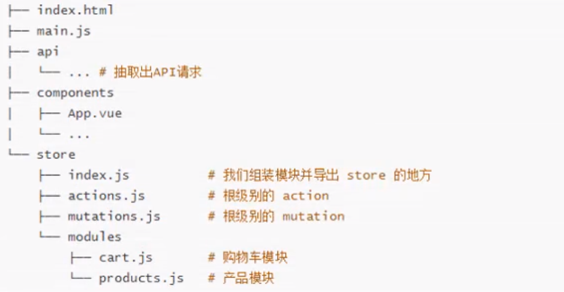

[TOC]

## 一、ES6补充

## 二、Vue初体验

## 三、插值的操作

## 四、v-bind 动态属性绑定

## 五、computed 计算属性

## 六、v-if 条件判断

## 七、v-for 循环遍历

## 八、书籍购物车案例

## 九、v-model 双向绑定

## 十、组件化开发

## 十一、组件化高级

## 十二、前端模块化

## 十三、Webpack学习

## 十四、Webpack配置Vue环境

### 14.1 安装Vue

> **npm 安装 Vue**
>
> * **运行时也需要使用Vue，所以不适用--save-dev**

~~~shell
npm install vue --save
~~~

> 打包后报错的解决方案：
>
> https://cn.vuejs.org/v2/guide/deployment.html

~~~javascript
<!-- 第一种解决方案（官网） -->
  plugins: [
    // 配置使用生产环境开发
    new webpack.DefinePlugin({
      'process.env.NODE_ENV': JSON.stringify('production')
    })
  ],
    <!-- 第二种解决方案 -->
  resolve:{
    alias:{
      'vue$':'vue/dist/vue.esm.js'
    }
  }  
~~~

### 14.2 在项目中直接使用Vue

> **在main.js中引入vue，并且在index.html中创建挂载点**

~~~javascript
//main.js
import Vue from 'vue';
new Vue({
  el:'#app',
  //template会替换掉el代表的标签
  template:`
    <div>
      <h2>{{message}}</h2>
    <button @click="btnClick">按钮</button>
    </div>
  `,
  data:{
    message:'hello webpack',
    name:'Jackson'
  },
  mounted() {
    console.log(this.message)
  },
  methods:{
    btnClick(){
      console.log(this.message+'  '+Math.random());
    }
  }
})
~~~

~~~html
<!-- index.html -->
<body>
<div id="app">
  <h2>{{message}}</h2>
</div>
<script src="./dist/bundle.js"></script>
</body>
~~~

### 14.3 使用Vue的高级方法

~~~javascript
//写在main.js中
import Vue from 'vue';
//高级解决方案,抽取模块
const App = {
  template: `
    <div>
      <h2>{{message}}</h2>
      <button @click="btnClick">按钮</button>
    </div>`,
  data(){
    return {
      message: 'hello webpack',
      name: 'Jackson'
    }
  },
  methods:{
    btnClick() {
      console.log(this.message + '  ' + Math.random());
    }
  }

}
//调用app组件
new Vue({
  el: '#app',
  //template会替换掉el代表的标签
  template:'<app />',
  components:{
    app:App
  }
})
~~~

<strong style="color:red">或者这样</strong>

~~~javascript
//app.js
let App = {
  template: `
    <div>
      <h2>{{message}}</h2>
      <button @click="btnClick">按钮</button>
    </div>`,
  data(){
    return {
      message: 'hello webpack',
      name: 'Jackson'
    }
  },
  methods:{
    btnClick() {
      console.log(this.message + '  ' + Math.random());
    }
  }
}
export default App
~~~

<strong style="color:red">直至这样</strong>

~~~vue
//App.vue
<template>
  <div>
    <h2>{{ message }}</h2>
    <button @click="btnClick">按钮</button>
  </div>
</template>

<script>
export default {
  name: "App",
  data() {
    return {
      message: 'hello webpack',
      name: 'Jackson'
    }
  },
  methods: {
    btnClick() {
      console.log(this.message + '  ' + Math.random());
    }
  }
}
</script>

<style scoped>
  h2{
    color: greenyellow;
  }
</style>
~~~

### 14.4 安装vue-loader

#### 14.4.1 应用简写的问题

> 对于import的时候是否可以简写后缀：import Cpn from "./Cpn.vue";
>
> 如果需要简写，需要修改webpack配置文件，因为默认查找的是.js文件

~~~javascript
  resolve:{
    //配置可以省略的后缀名称
    extensions:['.js','.css','.vue'],
    alias:{
      'vue$':'vue/dist/vue.esm.js'
    }
  }
~~~

#### 14.4.2 vue-loader安装

> **安装vue-loader和vue-template-compiler**

~~~shell
npm install vue-loader vue-template-compiler --save-dev
~~~

#### 14.4.3 vue-loader配置

> 修改webpack.config.js中的配置文件

~~~javascript
// 引入插件依赖
const VueLoaderPlugin = require('vue-loader/lib/plugin');

//配置vue-loader
{
  test: /\.vue$/,
    use: {
      loader: 'vue-loader'
    }
}
//配置插件
plugins: [
  //// 配置使用生产环境开发
  //new webpack.DefinePlugin({
  //  'process.env.NODE_ENV': JSON.stringify('production')
  //})
  new VueLoaderPlugin()
]  
~~~


## 十五、 Vue CLI(Vue脚手架)

### 15.1.什么是Vue CLI

> * 如果你只是简单写几个Vue的Demo程序，那么你不需要Vue CLI.
> * 如果你在开发大型项目，那么你需要，并且必然需要使用Vue CLI
>   * 使用Vue.js开发大型项目时，我们需要考虑代码目录结构、项目结构和部署、热加载、代码单元测试等事情。
>   * 如果每个项目都要手动完成这些工作，那无疑效率比较低，所以我们通常会使用一歇脚手架工具来帮助完成这些事情。
> * CLI是什么意思？
>   * CLI是Command-Line Interface，翻译为命令行界面，但是俗称脚手架。
>   * Vue CLI是一个官方发布的vue.js项目脚手架。
>   * 使用vue-cli可以快速搭建Vue开发环境以及对应的webpack配置。

### 15.2.Vue CLI的安装

> 安装脚手架

~~~shell
npm install -g @vue/cli
~~~

> 使用脚手架创建项目

~~~shell
#vue 2.x版本创建方式
vue init webpack <project-name>

#vue3.x创建方式
vue create < project-name >
~~~

## 十六、RuntimeOnly和Runtime Compiler创建项目的区别

### 16.1.Runtime-compiler流程图


> 主要区别：

> 使用rumtime-compiler：
>
> * template  -> ast(抽象语法树) -> render  -> vdom -> UI
>
> 使用runtime-only：(性能更高，代码更少)
>
> * render ->  vdom -> UI
> * **性能更高**
> * **代码更少**
> * <strong style="color:red">但是只允许使用.vue文件</strong>

**主要区别在于main.js中表现：**

~~~javascript
//runtime-compiler
import Vue from 'vue'
import App from './App'

Vue.config.productionTip = false

/* eslint-disable no-new */
new Vue({
  el: '#app',
  components: { App },
  template: '<App/>'
})
~~~


~~~javascript
//runtime-only
import Vue from 'vue'
import App from './App'

Vue.config.productionTip = false

/* eslint-disable no-new */
new Vue({
  el: '#app',
  render: h => h(App)
})

~~~

### 16.2. Render函数到底是什么？

~~~javascript
new Vue({
  el: '#app',
  render: function(createElement){
    //1.createElement('标签',{标签的属性},['']),
    //替换el挂载的标签
    return createElement('h2',{class:'box',style:'color:red'},['Hello World'])
  }
})
~~~

~~~javascript
//更复杂的方式
const cpn={
  template:'<div>{{message}}</div>',
  data(){
    return{
      message:'你好啊'
    }
  }
}

new Vue({
  el: '#app',
  render: function (createElement) {
    //1.createElement('标签',{标签的属性},['']),
    //替换el挂载的标签
    //return createElement(
    //  'h2',
    //  {class:'box',style:'color:red'},
    //  ['Hello World']
    //)
    //2.可以传入一个新的对象，或者组件对象
    return createElement(
      'h2',
      {class: 'box', style: 'color:red'},
      ['Hello World',createElement('button',['按钮']),createElement(cpn)]
    )
  }
})
~~~

> 效果：

### 16.3. .vue文件中的template是谁处理的？

> 是由vue-template-compiler处理的，处理之后返回的是一个包含render函数的对象，**不包含template等模板文件**

## 十七、Vue CLI 3的内容

### 17.1 Vue CLI 3 简介

> vue-cli 3 与 2 版本有很多区别：
>
> * Vue-cli 3 是基于webpack 4打造的，Vue-cli 2 还是webpack 3。
> * Vue-cli 3 的设计原则是“0配置”，移除了配置文件根目录下，build和config等目录。
> * Vue-cli 3 提供了 vue ui命令，提供了可视化配置，更加人性化。
> * 移除了static文件夹，新增了public文件夹，并且index.html移动到了public中

### 17.2 Vue CLI 3 创建项目

~~~shell
vue create < project-name >
~~~

### 17.2 Vue CLI 3 运行项目

~~~javascript
npm run serve(可以查看package.json)
~~~

### 17.3 Vue CLI 3修改配置的方案

#### 17.3.1 通过 vue ui 命令导入项目，使用可视化页面进行修改

#### 17.3.2 通过@vue/cli-service/lib/Service.js修改

#### 17.3.3 通过vue.config.js修改

> vue.config.js名字是固定的，不可以自定义

~~~javascript
//使用此处配置覆盖默认的配置文件
module.exports={
}
~~~

## 十八、Vue-router 路由

### 18.0 官方文档

> 参见：https://router.vuejs.org/zh/

### 18.1 路由的概念

> 发展过程：
>
> * 后端渲染阶段：
>   * 后端负责数据生成和页面渲染
> * 前后端分离阶段：
>   * 后端只负责提供数据，不负责任何阶段的渲染和展示
>   * 后端API服务器、静态资源服务器
>   * 前端负责HTML、CSS和JS，通过AJAX从后端请求数据进行加工渲染
>   * 当移动端出现后，后端不用修改代码，直接复用原来的API接口就可以
> * **单页面富应用阶段：**
>   * 整个网页只有一个HTML页面
>   * 其实SPA最主要的特点就是在前后端分离的基础上增加了一层前端路由。
>   * 也就是前端来维护一套路由规则。

#### 18.1.1 基本概念

> 路由是一个网络工程里面的术语。
>
> 路由就是通过互联的网络把信息从源地址传输到目的地址的活动。

> 路由提供了两种机制：
>
> * 路由是决定数据包从**来源**到**目的地**的路径。
> * 转送将**输入端**的数据转移到合适的**输出端**。
> * 路由中有一个非常重要的概念叫路由表
>   * 路由表的本质是一个***映射表***，决定了数据包的流向。

#### 18.1.2 前端渲染/路由 和 后端渲染/路由

> 前端渲染：
>
> * 前端搭建
>
> 后端渲染：
>
> * 后端将生成的HTML和CSS文件返回给前端进行渲染展示。
> * 后端路由：后端处理URL和页面之间的关系

> **1. 目前前端流行的三大框架，都有自己的路由实现：**
>
> * Angular的ngRouter
> * React的ReactRouter
> * Vue的vue-router
>
> **2. vue-router**
>
> * vue-router是Vue.js官方的路由插件，它和vue.js是深度集成的，适合用于构建单页面应用。
>
> **3.vue-router是基于路由和组件的**
>
> * 路由用于设定访问路径，将路径和组件映射起来。
> * 在vue-router的单页面应用中，页面路径的改变就是组件的切换。

> * vue-router是官方的路由插件

#### 18.1.3 实现前端路由的两种方法（改变URL，但是页面不刷新）

##### 18.1.3.1 URL-HASH模式

> * URL的hash也就是锚点(#),本质上是改变window.location的href属性。
> * 我们可以通过直接赋值location.hash来改变href，但是页面不发生刷新。

~~~javascript
>location.href
<-"https://www.jd.com/"
>location.hash='/'
<-"/"
>location.href
<-"https://www.jd.com/#/"
>location.hash='/foo'
<-"/foo"
>location.href
<-"https://www.jd.com/#/foo"
~~~

##### 18.1.3.2 HTML5的HISTORY模式

> * **history.pushState({data:'hello'},title,'?url')**
>   * 这种方法会将路径推入栈中
> * **history.replaceState({},'','/foo')**
>   * 这种方法不会将路径推入栈中，只会替换当前栈顶

~~~javascript
//history.pushState()
-> location.href
<- "https://www.jd.com/#/foo"
-> history.pushState({},'','/foo')
<- undefined
-> location.href
<- "https://www.jd.com/foo"
-> history.pushState({},'','/')
<- undefined
-> location.href
<- "https://www.jd.com/"
~~~

~~~javascript
//history.replaceState()
location.href
"http://localhost:8080/"
history.replaceState({},'','/foo')
undefined
location.href
"http://localhost:8080/foo"
history.replaceState({},'','/foo/bar')
undefined
location.href
"http://localhost:8080/foo/bar"
~~~

~~~javascript
//history.go(int)
//int为跳转几步，可以为正也可以为负
history.go(-1) 等同于 history.back()
history.go(1)  等同于 history.forward()
~~~


### 18.2 vue-router基本使用

#### 18.2.1 vue-router的安装

> **因为已经安装了webpack，可以直接通过工程化的方式进行开发：**
>
> * 可以直接使用npm来安装vue-router
> * 步骤一：安装vue-router
>
> > ~~~shell
> >  npm install vue-router --save
> > ~~~
>
> * 步骤二：在模块化工程中使用它（因为是一个插件，所以可以通过Vue.use()来安装路由功能）
>
>   1. <strong style="color:red">导入</strong>路由对象，并且<strong style="color:red">调用Vue.use(VueRouter)</strong>
>   2. 创建<strong style="color:red">路由实例</strong>，并且传入路由<strong style="color:red">映射配置</strong>
>   3. 在<strong style="color:red">Vue实例</strong>中<strong style="color:red">挂载</strong>创建的<strong style="color:red">路由实例</strong>
>

~~~javascript
//index.js
//配置路由相关的信息
import VueRouter from "vue-router";
import Vue from 'vue'
import Mine from "../components/Mine";
import Index from "../components/Index";

//1.通过Vue.use(插件)，使用插件
Vue.use(VueRouter)

export default new VueRouter({
  //配置路由和组件之间的引用关系
  routes: [
    {
      path: '/mine',
      name:Mine,
      component:Mine
    },
    {
      path: '/',
      name:Index,
      component:Index
    },
  ]
})

//将VueRouter对象传入到Vue实例中
~~~

~~~javascript
import Vue from 'vue'
import App from './App'
//会自动查找index文件，所以如果路由名称为index，可以省略
import router from './router/index'

Vue.config.productionTip = false

/* eslint-disable no-new */
new Vue({
  el: '#app',
  router,
  render: h => h(App)
})
~~~

#### 18.2.2 vue-router的配置

> 1. **创建路由组件**（各个需要路由的组件）
> 2. **配置路由映射：组件和路径映射关系**
> 3. **使用路由：通过< router-link >和< router-view >**

> * < router-link >：该标签是一个vue-router中已经内置的组件，它会被渲染成一个< a >标签。
> * < router-view >：该标签会根据当前的路径，动态渲染出不同的组件。
> * 网页的其他内容，比如顶部的标题/导航，或者底部的一些版权信息等会和< router-view >处于同一个等级。
> * 在路由切换时，切换的是< router-view >挂载的组件，其他内容不会发生改变。

~~~html
//App.vue
<template>
  <div id="app">
    
    <p>
      <router-link to="/home">home</router-link>
      <router-link to="/about">about</router-link>
    </p>
    <router-view/>
  </div>
</template>

~~~

> **修改url-hash为history模式：**
>
> * 在路由配置中，添加：mode:'history'即可

#### 18.2.3 router-link补充

> * **在前面的< router-link >中，我们只是使用了一个<strong style="color:red">属性：to</strong>，用于指定跳转的路径。**
> * < router-link >还有一些**其他属性：**
>   * <strong style="color:red">tag：</strong>tag可以指定< router-link >之后渲染成什么组件，比如添加 *tag="li"* 会被渲染成一个< li >元素，而不是< a >。
>   * <strong style="color:red">replace：</strong>replace不会留下history记录，所以指定replace的情况下，后退键返回不能返回到上一个页面中。**可以实现禁用返回按钮的功能！！！**
>   * <strong style="color:red">active-class：</strong>当< router-link >对应的路由匹配成功时，会自动给当前元素设置一个*router-link-active*的class,可以自定义这个class名称，以添加一些样式。默认为class = "router-link-exact-active  router-link-active"。**批量修改可以在路由配置文件中添加linkActiveClass来实现**

#### 18.2.4 使用代码控制路由跳转

> 某些情况下，需要自定义跳转逻辑，可以使用自定义的点击事件跳转，而不使用默认的router-link

~~~html
export default {
  name: 'App',
  methods:{
    homeClick(){
      console.log('homeClick');
      //通过代码的方式修改路由vue-router
      //不可以直接调用绕过vue直接修改history
      //所有组件里面都有$router属性
      //入栈
      this.$router.push('/home');
      //替换
      this.$router.replace('/home')
    },
    aboutClick(){
      console.log('aboutClick');
      this.$router.push('/about')
    }
  }
}
~~~

### 18.3 vue-router动态路由

**官方文档：https://router.vuejs.org/**

> **在某些情况下，一个页面的path路径可能是不确定的，比如我们进入用户界面时，希望是如下的路径：**
>
> * /user/foo 或 /user/bar
> * 除了有前面的/user之外，后面跟上了用户的ID
> * 这种path和Component的匹配关系，我们称之为动态路由（也是路由传递数据的一种方式）。

~~~javascript
//路由映射关系
{
  path: '/user/:id',
    component:User
}
~~~

~~~html
<!--Component-->
<!-- 使用$route.params.id获取动态路由/user/:id中绑定的id值 -->
<!-- $route可以获取的是当前活动路由，$router拿到的是根路由组件 -->
<div>
  <h2>{{$route.params.id}}</h2>
</div>
~~~

~~~html
<!-- App -->
<router-link to="/user/123">用户</router-link>
<!-- 使用如下方式实现动态数据传输 -->
<router-link replace tag="button" :to="'/user/'+userId">User</router-link>
<!-- 或者 -->
<button @click="userClick">用户</button>
<script>
  userClick(){
    this.$router.push('/user/'+this.userId)
  }
</script>
~~~

### 18.4 vue-router路由懒加载

#### 18.4.1 路由懒加载的概念和意义

> 官方解释：路由懒加载的必要性：
>
> * 当打包构建应用程序时，Javascript包会变得非常大，影响页面加载。
> * 如果我们能把不同路由对应的组件分隔成不同的代码块，然后当路由被访问的时候才加载对应组件，这样就更加高效了。
>
> 官方在说什么呢？
>
> * 首先，我们制动路由中通常会定义很多不同的页面。
> * 这个页面最后被打包在哪里呢？一般情况下，时放在一个js文件夹中。
> * 但是，这么多页面放在一个js文件中，必然会造成这个页面非常的大。
> * 如果我们一次性从服务器请求下来这个页面，可能需要花费一定的事件，甚至用户的电脑上还出现了短暂空白的情况。
> * 懒加载就是为了避免这种情况而使用的。
>
> 路由懒加载做了什么？
>
> * 路由懒加载的主要作用就是将路由对应的组件打包成一个个的js代码块。
> * 只有在这个路由被访问到的时候，才加载对应的组件。

#### 18.4.2 路由懒加载的实现方式

> **以下是路由懒加载的三种实现方式：**
>
> 1. **第一种：结合Vue的异步组件和Webpack的代码分析。（最早期的方式）**
> 2. **第二种：AMD的写法**
> 3. **第三种：在ES6中，我们可以使用更简单的写法来组织Vue异步组件和Webpack的代码分割。**
>
> 示例代码如下：

~~~javascript
//第一种实现方式的示例代码(早期的实现方式)
const Home = resolve => {
  require.ensure(['../components/Home.vue'], () => {
    resolve(require('../components/Home.vue'))
  })
}
~~~

~~~javascript
//第二种方式，AMD写法示例
const About = resolve => require(['../components/About.vue'], resolve)
~~~

~~~javascript
//第三种方式：（推荐）
const routes=[
  {
    path:'/home',
    component:() => import('../components/Home')
  },
  {
    path:'/about'
    component() => import('../components/About')
  }
]

//或者将组件放到一起以方便管理 

const Home = ()=>import('../components/Home')
const About = ()=>import('../components/About')
const User = ()=>import('../components/User')

const routes = [
  {
    path: '/',
    redirect: '/home'
  },
  {
    path: '/home',
    component:Home
  },
  {
    path: '/about',
    component: About
  },
  //动态路由，可以匹配/user/*
  {
    path: '/user/:userId',
    component: User
  }
]
~~~


### 18.5 vue-router嵌套路由

> **路由嵌套是一个很常见的功能：**
>
> * 比如在页面中，我们希望可以通过/home/news和/home/message访问一些内容
> * 一组路径映射一个组件，访问这两个路径也会分别渲染两个组件
>
> **路径和组件的关系如下：**
>
> 
>
> **实现路由嵌套有两个步骤：**
>
> 1. 创建对应的子组件，并且在路由映射中配置对用的子路由。
> 2. 在组件内部使用< router-view >标签。

> 示例代码如下：

~~~html
//Home.uve
<template>
  <div>
    <h2>我是首页</h2>
    <p>我是首页内容，哈哈哈</p>
    <router-link to="/home/news">新闻</router-link>
    <router-link to="/home/message">消息</router-link>
    <router-view/>
    <router-link to="/about">去关于</router-link>
  </div>
</template>

<script>
export default {
  name: "Home",
  data(){
    return {
      message:'Hello World',
    }
  },
  mounted() {
    document.title='主页'
  }
}
</script>

<style scoped>

</style>

~~~

~~~javascript
//router配置文件中配置
const Home = ()=>import('../components/Home')
const HomeNews = () => import('../components/HomeNews')
const HomeMessage = () => import('../components/HomeMessage')

const routes = [
  {
    path: '/home',
    component:Home,
    //使用子组件需要使用children声明
    children:[
      //配置默认显示的组件
      {
        path:'',
        redirect:'news'
      },
      {
        //子路由不可以加/
        path:'news',
        component:HomeNews
      },
      {
        path:'message',
        component:HomeMessage
      }
    ]
  }
]
~~~


### 18.6 vue-router参数传递

> **传递参数主要有两种类型：params和query**

#### 18.6.1 第一种方式：params


>**params传值的实现流程：**
>
>1. 配置路由格式：<strong style="color:red">/router/:< paramName ></strong>
>2. 传递的方式：<strong style="color:red">在path后面跟上对应的值</strong>
>3. 传递后形成的路径：<strong style="color:red">/router/123、/router/abc</strong>
>4. 取值方式：<strong style="color:red">组件中使用{{$route.params.< paramName >}}</strong>

~~~html
<!-- 传值示例 -->
<!-- 传递固定数据 -->
<router-link to="/router/123">ToRouter</router-link>
<!-- 传递动态数据 -->
<router-link :to="'/router/'+useId">ToRouter</router-link>

<!-- 取值示例 -->
<h2>{{$route.params.id}}</h2>

<script>
  //...
	console.log(this.$route.params.id)
  //...
</script>
~~~


#### 18.6.2 第二种方式：query(可以传递大量数据)

> **query传值的实现流程：**
>
> 1. 配置路由格式：<strong style="color:red">/router</strong>，也就是普通配置格式
> 2. 传递的方式：对象中使用<strong style="color:red">query的key作为传递方式</strong>
> 3. 传递后形成的路径：<strong style="color:red">/router?id=123、/router?id=abc</strong>
> 4. 取值方式：组件中使用<strong style="color:red">组件中使用{{$route.query.< propName>}}</strong>

~~~html
<!-- 传值示例 -->
<!-- 传递user对象 -->
<!-- 使用router-link -->
<router-link replace tag="button" :to="{path:'/profile',query:user}">档案</router-link>

<!-- 自定义方法 -->
<button @click="profileClick">档案</button>
<script>
  profileClick(){
    this.$router.push({
      path:'/profile',
      query:this.user
    });
  }
</script>

<!-- 取值示例 -->
<p>姓名：{{ $route.query.name }}</p>
<p>年龄：{{ $route.query.age }}</p>

<script>
export default {
  name: "Profile",
  mounted() {
    console.log(this.$route.query.name)
    console.log(this.$route.query.age)
  }
}
</script>
~~~


### 18.7 vue-router中router和route的区别

> 所有组件都集成自Vue的原型（Prototype）
>
> 可以使用Vue.prototype.test=function(){
>
> ​	console.log('test');
>
> }
>
> **则所有的组件都具备了这个test()方法；**
>
> this.$router和this.$route就是集成自Vue原型的。
>
> Router是全局的，可以用来进行跳转控制；
>
> route，用来进行获取当前路由，进行传值等操作。
>
> * **$route和$router是有区别的
>   * $router为VueRouter实例，想要导航到不同URL，则使用$router.push()方法
>   * $route为当前router跳转对象，里面可以获取name、path、query、params等


### 18.8 vue-router导航守卫

#### 18.8.1 为什么使用导航守卫

> **我们来考虑一个需求：在一个SPA应用中，如何改变网页的标题呢？**
>
> * 网页标题是通过< title >来设置的，但是SPA应用只有一个固定的HTML，切换不同的页面时，标题并不会改变。
> * 但是我们可以通过JavaScript来修改< title >的内容：window.document.title = '新的标题'。
> * 那么在Vue项目中，如何修改呢？什么时候修改比较合适呢？
> * 如何在跳转过程中进行验证、权限控制呢？
>
> **普通的修改方式：**
>
> * 我们比较容易想到的修改标题的方式是在每个路由对应的组件中，通过mouted()声明周期函数，执行对应的代码进行修改即可。
> * 但是当页面比较多时，这种方式就不容易维护了。
> * 所以，应该是使用导航守卫的方式来实现这个功能。

> **什么是导航守卫：**
>
> * vue-router提供的导航守卫主要用来监听路由的进入和离开。
> * vue-router提供了beforeEach和afterEach的钩子函数，它们会在路由即将改变和改变之后出发，可以在其中定义相应的业务逻辑实现需要的功能。
> * **类似于Java的切面？**

> **使用流程：**
>
> 1. 在每个路由中配置相应的元数据meta属性，设置title属性
> 2. 获取导航守卫：通过router.beforeEach()方法获取
> 3. 设置执行逻辑：document.title=to.matched[0].meta.title(**如果是二级路径，如/home/news，没有设置相应的meta属性，所以获取不到，但是可以从matched中获取其跟路径进行获取title**)

~~~html
<script>
const routes = [
  {
    path: '/',
    redirect: '/home'
  },
  {
    path: '/home',
    component: Home,
    meta: {
      title: '首页'
    },
    children: [
      {
        path: '',
        redirect: 'news'
      },
      {
        //子路由不需要加/
        path: 'news',
        component: HomeNews
      },
      {
        path: 'message',
        component: HomeMessage
      }
    ]
  },
  {
    path: '/about',
    component: About,
    meta: {
      title: '关于'
    }
  },
  //动态路由，可以匹配/user/*
  //使用params传递参数
  {
    path: '/user/:userId',
    component: User,
    meta: {
      title: '用户'
    }
  },
  //使用query的方式传递参数
  {
    path: '/profile',
    component: Profile,
    meta: {
      title: '档案'
    }
  }
]

const router = new VueRouter({
  //配置路由和组件之间的引用关系
  mode: 'history',
  routes,
  linkActiveClass: 'hello'
})

//添加全局导航守卫，前置回调（hook）函数
router.beforeEach((to, from, next) => {
  //从from跳转到to
  //只取第一级组件的名称
  document.title = to.matched[0].meta.title;
  console.log(to)
  //放行请求，类似filter放行
  next()
})
</script>
~~~

#### 18.8.2 导航守卫的补充

> **补充一：如果是后置钩子，也就是afterEach，不需要主动调用next()函数**
>
> **补充二：上面所使用的导航守卫，叫做*全局守卫* **
>
> * 路由独享的守卫（为路由单独设置守卫）
> * 组件内的守卫（组件内设置守卫实现更细节的控制）
> * 详细内容参见：https://router.vuejs.org/zh/

### 18.9 keep-alive保持状态

#### 18.9.1 keep-alive是什么

> **keep-alive是Vue内置的一个组件，可以使被包含的组件保留状态，或避免重新渲染。**
>
> * 它有两个非常重要的属性：
> * include-字符串或正则表达式，只有匹配的组件会被缓存
> * exclude-字符串或正则表达式，任何匹配的组件都不会被缓存（常用）
>
> **router-view 也是一个组件，如果直接被包裹在keep-alive里面，所有路径匹配到的视图组件都会被缓存**

> 利用beforeRouteLeave实现路径的保存

> **单独设置某个组件不缓存：**

~~~html
<keep-alive include="*" exclude="Profile,User">
          <router-view/>
</keep-alive>
~~~


## 十九、TabBar实现思路

> TabBar

>***实现思路如下：***
>
>**如果在下方有一个单独的TabBar组件，你如何封装**
>
>* 自定义TabBar组件，在App中使用
>* 让TabBar处于底部，并且设置相关的样式
>
>**TabBar中显示的内容由外界决定**
>
>* 定义插槽
>* flex布局平分TabBar
>
>**自定义TabBarTtem，可以传入图片和文字**
>
>* 定义TabBarItem，并且定义两个插槽：图片和文字。
>* 给两个插槽外层包装div，用于设置样式。
>* 填充插槽，实现底部TabBar效果
>
>**出入高亮图片**
>
>* 定义另外一个插槽，插入active-icon的数据
>* 定义一个变量isActive，通过v-show来决定是否显示对应的icon
>
>**TabBarItem绑定路由数据**
>
>* 安装路由：npm install vue-router --save
>* 完成router/index.js的内容，以及创建对应的组件
>* main.js中注册router
>* APP中加入< router-view >组件
>
>**点击item跳转到对应路由，并且动态决定isActive**
>
>* 监听item的点击，通过this.$router.replace()替换路由路径
>* 通过this.$route.path.indexOf(this.likn) != -1来判断是否active
>
>**动态计算active样式**
>
>* 封装新的计算属性this.isActive ？ {'color':'red'}:{}

### Webpack-路径别名设置

> 在某些情况下，可以使用路径别名设置，简化开发过程中的配置

~~~javascript
resolve:{
  alias:{
    '@':resolve('src')
  }
}
~~~

~~~html

~~~


## 二十、Promise的使用

### 20.1 Promise简介

> **ES6中一个非常重要和好用的特性就是Promise**
>
> * <strong style="color:red">Promise是异步编程的一种解决方案。</strong>
>
> **什么时候我们会需要异步处理事件呢？**
>
> * 一种很常见的场景就是网络请求。
> * 我们封装一个网络请求的参数，因为不能立即拿到结果，所有不能像简单的3+4=7一样将结果返回。
> * 所以往往我们会传入另外一个函数，在数据请求成功时，将数据通过传入的函数回调出去。
> * 如果只是一个简单的网络请求，那么这种方案不会给我们带来很大的麻烦。
>
> **但是，当网络请求非常复杂时，就会出现回调地狱，如下所示：**
>
> * 考虑这样一个场景：
>   * 我们需要一个url1从服务器加载一个数据data1，data1中包含了下一个请求url2
>   * 需要通过data1取出url2，从服务器加载data2，data2中包含下一个请求的url3
>   * .......
> * 上面的代码有什么问题呢？
>   * 正常情况下，不会出现什么问题。
>   * 但是这样的代码难看而且不容易维护。
>   * 我们希望使用一种更优雅的方式来实现这种异步操作。
> * 如何实现呢？
>   * Promise可以以一种非常优雅的方式来解决这个问题。

### 20.2 Promise的基本使用


> **我们先来看看Promise最基本的语法：**
>
> **这里，我们用一个定时器来模拟异步事件：**
>
> * 假设下面的data是从网络上1秒后请求的数据
> * console.log就是我们的处理方式
>
> **这是我们过去的处理方式，我们将它换成Promise代码**

~~~javascript
  //使用Promise进行封装
  new Promise(((resolve, reject) => {
    setTimeout(() => {
      resolve('hello world');
      reject('reject reason');
    }, 1000)
  })).then(data => console.log(data))
      .then(msg => console.error(msg))

//或者这种写法：用then处理fulfill和err
  new Promise((resolve, reject) => {
        setTimeout(()=>{
          resolve('hello world');
          reject('error ')
        })
      }
  ).then(res =>{
    console.log(res)
  },err=>{
    console.log(err)
  })


//多层请求存在嵌套关系可以采用链式编程可以实现
 //2.使用Promise进行封装(链式编程)
  new Promise((resolve, reject) => {
    console.log('第一次发送请求')

    setTimeout(() => {
      //发起第一次请求
      resolve({message:'第一次请求成功',nextUrl:'第二次请求url'})
    }, 1000)

  }).then(data => {
    //处理第一次的结果
    console.log(data.message)
    return new Promise(((resolve, reject) => {
      //发起第二次请求
      console.log('发送请求：'+data.nextUrl)
      setTimeout(()=>{
        resolve({message:'第二次请求成功',nextUrl:'第三次请求url'});
      },1000)
    }))
  }).then(data=>{
    //处理第二次请求处理结果
    console.log(data.message)
    return new Promise((resolve, reject) => {
      //发起第三次请求
      console.log('发送请求：'+data.nextUrl)
      setTimeout(()=>{
        resolve({message:'第三次请求成功',nextUrl:'第三次请求url'});
      },1000)
    })
  }).then(data=>{
    //处理第三次结果
      console.log(data.message);
  })
~~~

### 20.3 Promise的三种状态

> **首先，当我们开发中由异步操作时，就可以给异步操作封装一个Promise**
>
> **异步操作之后会有三种状态**
>
> * pending：等待状态，比如正在进行网络请求，或者定时器没有到时间
> * fulfill：满足状态，当我们主动毁掉了resolve时，就处于该状态，并且会回调.then()方法
> * reject：拒绝状态，当我们主动回调了reject()方法时，就处于该状态，并且会回调.catch()方法。

### 20.4 Promise的链式调用

> 在Promise结果处理handler中返回新的Promise对象，就可以继续进行.then()、.catch()的调用

~~~javascript
 new Promise((resolve, reject) => {
    console.log('第一次发送请求')

    setTimeout(() => {
      //发起第一次请求
      resolve({message:'第一次请求成功',nextUrl:'第二次请求url'})
    }, 1000)

  }).then(data => {
    //处理第一次的结果
    console.log(data.message)
    return new Promise(((resolve, reject) => {
      //发起第二次请求
      console.log('发送请求：'+data.nextUrl)
      setTimeout(()=>{
        resolve({message:'第二次请求成功',nextUrl:'第三次请求url'});
      },1000)
    }))
  }).then(data=>{
    //处理第二次请求处理结果
    console.log(data.message)
    return new Promise((resolve, reject) => {
      //发起第三次请求
      console.log('发送请求：'+data.nextUrl)
      setTimeout(()=>{
        resolve({message:'第三次请求成功',nextUrl:'第三次请求url'});
      },1000)
    })
  }).then(data=>{
    //处理第三次结果
      console.log(data.message);
  })
~~~

> **调用Promise对结果进行链式处理（Promise.resolve(data)）：**
>
> * 如果希望数据直接包装成Promise.resolve,那么在then种可以直接返回数据。
> * 直接返回数据也是可以的
> * 处理异常，可以通过返回Promise.reject()或者throw ‘error message’实现
> * 发生异常后，后续的then不会继续执行。

~~~javascript
//原来的处理方式
  new Promise((resolve, reject) => {
    setTimeout(() => {
      resolve('aaa')
    }, 1000)
  }).then(data => {
    //处理data
    console.log('第一层的处理代码', data)
    return new Promise(resolve => {
        resolve(data + '111');
    })
  }).then(data => {
    console.log('第二层处理：' + data);
    return new Promise(resolve => {
        resolve(data + '222');
    })
  }).then(data => {
    console.log('第三次处理：' + data)
  })

//修改后的处理方式（简单的写法）
  new Promise((resolve, reject) => {
    setTimeout(() => {
      resolve('aaa')
    }, 1000)
  }).then(data => {
    //处理data
    console.log('第一层的处理代码', data)
    return Promise.resolve(data+'111');
    //处理出错的方式
    //return Promise.reject(data+'111');
  }).then(data => {
    console.log('第二层处理：' + data);
    return Promise.resolve(data+'222');
  }).then(data => {
    console.log('第三次处理：' + data)
  })


//更简洁的写法
  new Promise((resolve, reject) => {
    setTimeout(() => {
      resolve('aaa')
    }, 1000)
  }).then(data => {
    //处理data
    console.log('第一层的处理代码', data)
    return data+'111';
  }).then(data => {
    console.log('第二层处理：' + data);
    return data+'222';
  }).then(data => {
    console.log('第三次处理：' + data)
  })

  new Promise((resolve, reject) => {
    setTimeout(() => {
      resolve('aaa')
    }, 1000)
  }).then(data => {
    //处理data
    console.log('第一层的处理代码', data)
    //return data+'111';
    //抛出异常的方法
    throw '发生异常了';
  }).then(data => {
    console.log('第二层处理：' + data);
    return data+'222';
  }).then(data => {
    console.log('第三次处理：' + data)
  }).catch(err=>{
    console.log(err);
  })
~~~

### 20.5 Promise的all方法

> **Promise中的all()方法，当需求场景需要多个异步请求的结果时，可以使用这个方法**
>
> * 网络请求一/网络请求二

~~~javascript
//需求本身需要两个请求全部返回正确数据才可以完成
  Promise.all([
    new Promise(resolve => {
      setTimeout(()=>{
        resolve(123);
      },1000)
    }),
    new Promise((resolve) => {
      setTimeout(()=>{
        resolve(23)
      },3000)
    })
  ]).then(results=>{
		//results为参数中的结果集合
    console.log(results);
  })
~~~


## 二十一、Vuex详解

> 官网地址：https://vuex.vuejs.org/zh/

### 21.1 Vuex简介

> **官方解释：Vuex是一个专为Vue.js应用程序开发的*状态管理模式***
>
> * 它采用<strong  style="color:red">集中式存储管理</strong>应用的所有组件的状态，并以相应的规则保证状态以一种可预测的方式发生变化。
> * Vuex也集成到Vue的官方调式工具<a href="https://github.com/vuejs/vue-devtools">devtools extension</a>，提供了诸如零配置的time-travel调试、状态快照导入导出等高级调试特性。


#### 21.1.1 什么是状态管理

> * **状态管理模式、集中式存储管理**这些名词听起来就非常高大上。
> * 其实，你可以简单的将其看成把需要多个组件共享的变量全部存储在一个对象里面。
> * 然后，将这个对象放在顶层的Vue实例中，让其他组件可以使用。
> * 那么，多个组件是不是就可以共享这个对象中的所有变量属性了呢？
> * 多个组件共享的时候，存在修改和传递需要经过很多层的弊端。

~~~javascript
//但是这种数据不是响应式的！！！
Vue.protoType.shareObj={name:'张三'}
//组件内使用即可获取
this.shareObj.name
~~~

> **使用Vue官方提供的插件Vuex就可以解决这个问题：提供一个在多个组件间共享状态的插件，用它就可以了。**

### 21.2那些状态需要进行状态管理

> **有哪些状态时需要我们在多个组件间共享的呢？**
>
> * 如果你做过大型开发，你一定遇到过多个装填，在多个界面见的共享问题。
> * 比如用户的登录状态、用户名称、头像、地理位置信息等。
> * 比如商品的收藏、购物车中的商品等。
> * 这些状态信息，我们都可以放在统一的地方，对他们进行保存和管理，而且它们还是响应式的。

### 21.3 Vuex的安装

> 安装Vuex

~~~shell
npm install vuex --save
~~~

### 21.4 Vuex的使用

> 1. **src文件夹下新建store文件夹**
> 2. **store文件夹下新建store配置文件index.js文件**
> 3. 导入Vue和Vuex(index.js中)
> 4. Vue.use(Vuex)
> 5. 创建Vuex.Store对象并初始化
> 6. 导出上一步创建的store对象
> 7. 将store注册到Vue实例中（main.js）
>
> **取值：**
>
> * 因为挂载到Vue实例的对象会自动注册到原型上：$store
> * 所以可以通过$store.state.counter可以取值

~~~javascript
//store.js配置文件
//1.导入依赖
import Vue from "vue";
import Vuex from 'vuex'
//2.安装插件
Vue.use(Vuex)

//3.创建对象
const store= new Vuex.Store({
  //保存状态
  state:{
    counter:1000
  },
  mutations:{
    //定义方法
    increment(){
      
    }

  },
  actions:{

  },
  getters:{

  },
  modules:{

  }

})

//4.导出对象
export default store;


~~~

### 21.5 Vuex-devtools和Mutations

> **直接修改$store.state的时候devtools时监控不到的，所以应该使用mutations修改，实现数据追踪的目的**
>
> **使用步骤：**
>
> 1. 提取出一个公共的store对象，用于保存在多个组件中共享的装填
> 2. 将store对象放置在Vue实例中，这样可以保证所有的组件中都可以使用到。
> 3. 在其他组件中使用store对象中保存的状态即可：
>    1. 通过this.$store.state.attrName的方式来访问状态
>    2. 通过this.$store.commit('mutations中的方法名')来修改状态
>
> **注意事项：**
>
> * 我们需要通过提交mutation的方式，而非直接改变store.state.count
> * 这是因为Vuex可以更明确的追踪状态的变化，所以不要直接改变store.state.count的值

~~~javascript
//在Vuex.store中定义commit的方法
const store = new Vuex.Store({
  //保存状态
  state: {
    counter: 3
  },
  mutations: {
    incrementCounter(state) {
      state.counter++;
    },
    decrementCounter(state){
      state.counter--;
    }
  },
  actions: {},
  getters: {},
  modules: {}

})
~~~

~~~html
<!-- 在需要更改的地方调用commit(方法名,数据)方法修改 -->
<button @click="add">+</button>
function add(){
	this.$store.commit('increment',[payload])
}
~~~

### 21.6 Vuex中的核心概念

> **Vuex中有几个比较核心的概念：**
>
> * State：状态、属性
> * Getters：类似于计算属性
> * Mutation：改变数据的方法
> * Action：做一些异步操作，不要放在Mutation中，放在这里
> * Module：分模块保存数据

#### 21.6.1 State单一状态树

> **Vuex提出使用单一状态树：**
>
> * 英文名称：Single Source of Truth，也可以翻译成单一数据源。
>
> **但是，它是什么呢？**
>
> * 我们知道，在生活中，我们由很多的信息需要被记录，比如上学时的个人档案，工作后的社保记录，公积金记录，结婚后的婚姻信息，以及户口、医疗、文凭等。
> * 这些信息被分散到很多地方进行管理，这种方式不仅不方便管理，而且维护也是很麻烦的工作。
>
> **这个和我们的应用开发比较类似：**
>
> * 如果状态信息保存到多个Store对象中，那么之后的管理和维护等等都会变得特别困难。
> * 所以Vuex也使用了单一状态树来管理应用层级的全部状态。
> * 单一状态树能够让我们能够以最直接的方式找到某个状态的片段，而且在之后的维护和调试过程中，也可以非常方便的管理和维护。

#### 21.6.2 Getters基本使用

> **Getters：有时候，我们需要从store中获取一些state变异后的状态，比如下面的store：**

> **一、通过属性使用Getters：这种用法适合不需要传递参数的情况**

~~~javascript
//存值
const store = new Vuex.Store({
  state:{
    students:[
      {id:110,name:'why',age:18},
      {id:111,name:'kobe',age:21},
      {id:112,name:'likei',age:20},
    ]
  },
  getters:{
    greaterAgesCount:state => {
      return state.students.filter(s => s.age>=20).length;
    }
  }
})
~~~

~~~html
<!-- 取值 -->
<h2>{{$store.getters.greaterAgesCount}}</h2>
~~~

> **二、通过方法使用Getters：这种方法适合对Getters进行传参：**

```js

  getTodoById: (state) => (id) => {
    return st
//取值
store.getters.getTodoById(2) // -> { id: 2, text: '... false }
```

~~~javascript
  getters: {
    //将getters传递进去
    greaterAgesCount: (state,getters) => {
      //调用getters中的属性获取需要的值
      return getters.greaterAges.length
    },
    greaterAges:state => {
      return state.students.filter(s => s.age >=20);
    }
  }
~~~

> **三、为Getters作为参数和传递参数**

~~~javascript
//age,参数名称
greaterAges: (state) => age => state.students.filter(s => s.age >= age)
~~~

#### 21.6.3 Mutation

##### 21.6.3.1 Mutations状态更新

> **Vuex的store状态的更新唯一方式：提交Mutation：**
>
> **Mutation主要包括两部分：**
>
> * 字符串的**事件类型（type）**
> * 一个**回调函数（handler）**，该回调函数的第一个参数就是state
>
> **mutation的定义方式：**
>
> ~~~javascript
> mutations:{
>   increment(state){
>     state.counter++;
>   }
> }
> ~~~
>
> **通过mutation更新：**
>
> ~~~javascript
> increment : function(){
>   this.$store.commit('incremnt')
> }
> ~~~

##### 21.6.3.2 Mutations携带参数

> **在通过mutation更新数据的时候，有可能我们希望携带一些额外的参数**
>
> * 参数被称为是mutation的载荷（Payload）
> * 可以传递单一参数，也可以传递对象

> **传递一个参数：**

~~~javascript
//App.vue
methods:{
    increment(){
      this.$store.commit('incrementCounter',1)
    },
    addCount(val) {
      this.$store.commit('incrementCounter', val)

    }
  }
~~~

~~~javascript
//store.js
mutations: {
    incrementCounter(state, val) {
      state.counter += val;
    },
    decrementCounter(state) {
      state.counter--;
    }
  },
~~~

> **传递多个参数：使用对象封装即可**

##### 21.6.3.3 Mutations的提交风格

> 上面提到的通过commit提交是一种普通的方式。
>
> Vue还提供了另外一种风格，它是一个包含type属性的对象

~~~javascript
//示例代码
//提交
this.$store.commit({
  type:'changeCount',
  count:100
})

//取值代码
  mutations: {
    incrementCounter(state, obj) {
      state.counter += obj.val;
    }
  }
~~~

##### 21.6.3.4 Mutations的响应规则

> **Vuex的store中的state是响应式的，当state中的数据发生改变时，Vue组件会自动更新。**
>
> **这就要求我们必须遵守一些Vuex对应的规则：**
>
> * 提前在store中初始化好所需要的属性（和响应式实现原理有关）
> * 当给state中的对象添加新的属性时，使用下面的方式：
>   * 方式一：使用Vue.set(obj,'newProp',123)
>   * 方式二：用新对象给旧对象重新赋值

~~~javascript
//示例代码
//添加新的根属性
Vue.set(state,'infoTest',{text:'hello world'})
//删除原有属性
Vue.delete(state.info,name)
//修改原有根属性
state.info={time:'123123',name:'hello world'}
~~~

##### 21.6.3.5 Mutation中的常量类型【<span style="color:red">可选</span>】

> 在Mutation中声明常量，作为方法名称：可以防止名称写错
>
> **我们来考虑下面的问题：**
>
> * 在mutation中，我们定义了很多事件类型（也就是其中的方法名称）
> * 当我们的项目增大时，Vuex管理的状态越来越多，需要更新状态的情况越来越多，那么意味着Mutation中的方法越来越多。
> * 方法过多，使用者需要花费大量的精力去记住这些方法，甚至是在多个文件间来回切换，查看方法名称，如果不是复制的情况下，可能还会出现写错的情况。

~~~javascript
//mutation-types.js
export const INCREMENT = 'increment';

//App.vue
import {INCREMENT} from "./store/mutation-types";
methods:{
    increment(val){
      this.$store.commit(INCREMENT,val)
}

//store.js
import {INCREMENT} from "./store/mutation-types";
mutations: {
    [INCREMENT](state,val){
      state.info.name=val;
    }, 
}
~~~

#### 21.6.4 Action基本概念

> **通常情况下，Vuex要求我们Mutation中的方法必须是同步方法。**
>
> * 主要的原因是当我们使用devtools，devtools可以帮助我们捕捉mutation的快照。
> * 但是如果是异步操作，那么devtools将不能很号的跟踪这个操作什么时候会被完成。
> * **通常情况下，不要在mutation中进行异步操作**
>
> **我们强调：不要再Mutation中进行异步操作。**
>
> * 虽然在某些情况下，我们确实希望在Vuex中进行一些异步操作，比如网络请求，必然是异步的，这个时候怎么处理呢？
> * Action类似于Mutation，但是是用来替代Mutation进行异步操作的
> * 使用Action需要调用this.$store.dispatch()方法

##### 21.6.4.1 Action的基本使用代码

> 第一种方式：使用回调函数

~~~javascript
//store.js
mutations: {
    updateInfo(state,info){
      state.info.name='Jordan'+info;
    }
  },
actions: {
    //action中没有state，有默认的上下文context
    aUpdateInfo(context,payload){
      setTimeout(()=>{
          context.commit('updateInfo',payload.message);
          payload.success();
      },1000)
    }
  }
//App.vue中
methods:{
    updateInfo(){this.$store.dispatch('aUpdateInfo',{
        message:'我是携带的信息'，
        success:()=>{
        //回调函数
        console.log('修改完成')
    }
    })
    }
}
~~~

> 第二种方式：使用Promise<strong style="color:red">推荐</strong>

~~~javascript
//App.vue
updateInfo(){
    this.$store.dispatch('aUpdateInfo',{
        message:'我是参数'
      }).then((data)=>{
        console.log('执行成功了'+data)
      })
}

//store.js
active:{
    aUpdateInfo(context,payload){
      console.log(payload.message);
      return new Promise((resolve, reject) => {
        setTimeout(()=>{
          context.commit('updateInfo',payload.message);
          resolve('执行完毕了')
        },1000)
      })
    }
}
~~~

#### 21.6.5 Module详解

> **Module是模块的意思，为什么在Vuex中我们要使用模块呢？**
>
> * Vuex使用单一状态树，那么也以为着很多状态都会交给Vuex来管理。
> * 当应用变得非常复杂时，store对象就有可能变得相当臃肿。
> * 为了解决这个问题，Vuex允许我们将store分割成模块（module）,而每个模块拥有自己的state、mutations、actions、getters等。

~~~javascript
const moduleA={
  state:{},
  mutations:{},
  getters:{
      fullname(state){
          return state.name + '111';
      },
      fullname2(state,getters){
          return getters.fullname+'222';
      },
      //可以利用第三个参数传递rootState
      fullname3(state,getters,rootState){
          return getters.fullname2+rootState.counter;
      }
  },
  actions:{
    //这个context只是当前的上下文，只能修改调用muduleA中的mutations
  	aUpdateName(context)  {
    	context.commit('updateName','name11')
    }
  }
}

const moduleB={
  state:{},
  mutations:{},
  actions:{},
  getters:{}
}

const store = new Vuex.Store({
  modules:{
    a:moduleA,
    b:moduleB
  }
})
//在调用的时候采用这种方式就可以了
store.state.a //moduleA的状态
store.state.b //moduleB的状态
//{{$store.state.a.name}}
//提交方式，会查询对应的name，所以最好不要重名
this.$store.commit('updateName',payload)
{{$store.getters.fullname}}

~~~

#### 21.6.6 Vuex-store文件夹的目录组织

> Actions的写法呢？接收一个context参数对象
>
> * 局部状态通过context.state暴漏出来，根节点状态则为context.rootState
>
>   ~~~javaxcript
>   const moduleA={
>   	actions:{
>   		increment({state,commit,rootState}){
>   			if((state.count + rootState.count) % 2 ===1){
>   				commit('increment')
>   			}
>   		}
>   	}
>   }
>   ~~~
>   
> * 如果getters中也需要使用全局的状态，可以接受更多的参数
>
>    ~~~javascript
> 	const moduleA = {
> 		getters:{
> 		sum({state,getters,rootState}){
>                return state.count + rootState.count;
> 	        }
>       }
>    }
>    ~~~
>

> **当我们的Vuex帮助我们管理过多的内容时，好的项目结构可以让我们的代码更加清晰：**




## 二十二、 网络请求模块的封装

### 22.1 选择什么网络模块

> **Vue中发送网络请求有非常多的方式，那么在开发中如何选择呢？**
>
> * 选择一：传统的Ajax时基于XMLHttpRequest（XHR）的，为什么不选择它呢？
>   * 非常好解释，配置和调用方式非常混乱
>   * 编码看起来非常蛋疼
>   * 真实开发中很少直接使用，而是使用jQuery-Ajax
> * 选择二：jQuery-Ajax，为什么不选择它呢？
>   * 首先：在Vue的整个开发中都是不需要使用jQuery的
>   * 如果为了一个网络请求引入一个jQuery，不合理
>
> **为什么选择axios，作者推荐和功能特点：**
>
> * 在浏览器发送XMLHttpRequest请求
> * 在node.js中发送http请求
> * 支持Promise API
> * 可以拦截请求和响应
> * 转换请求和响应数据

### 22.2 Axios的安装

> 通过npm安装
>
> 官方网站：
>
> 模拟网站：httpbin.org

~~~shell
npm install axios --save
~~~


### 22.2 Axios的基本使用

#### 22.2.1 Axios请求方式

> 1. axios(config)
> 2. axios.request(config)
> 3. axios.get(url[,config])
> 4. axios.post(url[,data[,config]])
> 5. axios.put(url[,data[,config]])
> 6. axios.delete(url[,config])
> 7. axios.head(url[,config])
> 8. axios.patch(url[,data[,config]])

~~~javascript
//axios(config)
Axios({
  method: 'get',
  url: dataUrl
}).then(data => console.log(data))

//axios.get('url',[{config:config}])
const poetryUrl = 'http://poetry.rainbase.cn/poetry/random'
Axios.get(poetryUrl).then(data=>console.log(data))

//拼接query
Axios({
  method: 'get',
  url: baseURL+dataUrl+'?type=pop&page=1'
}).then(data => {
  console.log(data)
})
console.log(baseURL+dataUrl+'?type=pop&page=1')
//对象传递query
Axios({
  url:baseURL+dataUrl,
  params:{
    type:'pop',
    page:1
  }
}).then(res=>{
  console.log(res)
})
~~~

#### 22.2.2 Axios发送并发请求

> **有时候需要发送多个请求才能执行结果，所以可能需要并发请求：**
>
> * 使用axios.all()方法，可以翻入多个请求的数组。
> * axios.all([])返回的结果是一个数组，使用axios.spread可以将数组展开为res1，res2

~~~javascript
//axios发送并发请求，对多个请求进行合并
Axios.all([
  Axios.get(poetryUrl),
  Axios({
    url:baseURL+dataUrl,
    params:{
      type:'pop',
      page:1
    }
  })
]).then(results=>{
  console.log(results)
})

//对结果进行分割
Axios.all([
  Axios.get(poetryUrl),
  Axios({
    url:baseURL+dataUrl,
    params:{
      type:'pop',
      page:1
    }
  })
]).then(Axios.spread((res1,res2)=>{
  console.log(res1);
  console.log(res2)
}))
~~~

#### 22.2.3 Axios全局配置

##### 22.2.3.1 配置语法

> **在上面的实例中，我们的BaseURL是固定的：**
>
> * 事实上，在开发中可能很多参数都是固定的。
> * 这个时候我们可以进行一些抽取，也可以利用axios的全局配置

~~~javascript
axios.defaults.baseURL = 'http://localhost:8080';
axios.defaults.timeout = 5;
axios.defaults.headers.post['Content-Type'] = 'application/x-www.form-urlencoded';

//拼接query
Axios({
  method: 'get',
  url: '/home/data' + '?type=pop&page=1'
}).then(data => {
  console.log(data)
})

//对象传递query
Axios({
  url: '/home/data',
  params: {
    type: 'pop',
    page: 1
  }
}).then(res => {
  console.log(res)
})
~~~

##### 22.2.3.2 常见配置选项

> 1. 请求地址：url:'/user'
> 2. 请求类型：method:'get'
> 3. 请求根路径：baseURL:'http://www.mt.com/api'
> 4. 请求前的数据处理:transformRequest:[function(data){}]
> 5. 请求后的数据处理：transformResponse:[function(data){}]
> 6. 自定义的请求头：headers:{'x-Requested-With' : 'XMLHttpRequest'}
> 7. URL查询对象：params:{id:12}

| 类别               | 示例                                            | 描述                                        |
| ------------------ | ----------------------------------------------- | ------------------------------------------- |
| 请求地址           | url:'/user'                                     |                                             |
| 请求类型           | method:'get'                                    |                                             |
| 请求根路径         | baseURL:'http://www.mt.com/api'                 |                                             |
| 请求前的数据处理   | transformRequest:[function(data){}]             |                                             |
| 请求后的数据处理   | transformResponse:[function(data){}]            |                                             |
| 自定义的请求头     | headers:{'x-Requested-With' : 'XMLHttpRequest'} |                                             |
| URL查询对象        | params:{id:12}                                  |                                             |
| 查询对象序列号函数 | paramsSerializer:function(params)()             |                                             |
| request body       | data:{key:'aa}                                  |                                             |
| 超时设置           | timeout：1000（毫秒）                           |                                             |
| 跨域是否携带token  | withCredentials：false                          |                                             |
| 自定义请求处理     | adapter:function(resolve,reject,config)()       |                                             |
| 身份验证信息       | auth:{uname:'',pwd:'12}                         |                                             |
| 响应数据格式       | responseType:'json                              | json/blob/document /arraybuffer/text/stream |

### 22.3 Axios实例和模块封装

#### 22.3.1 创建多个Axios实例

> 在可能存在多个服务的时候，baseURL是不同的，所以，可以根据需要配置需要的Axios实例，来配置多个请求路径的问题。

~~~javascript
//创建实例使用Axios
//创建首页的实例
const homeAxios = Axios.create({
  baseURL:'http://152.136.185.210:8000/api/z8',
  timeout:5000
})

homeAxios({
  url:'/home/data',
  params:{
    type:'pop',
    page:1
  }
}).then(res=>{
  console.log(res)
})

//创建poetry的实例
const poetryAxios = Axios.create({
  baseURL:'http://poetry.rainbase.cn',
  timeout:300
})

poetryAxios({
  url:'/poetry/random'
}).then(res=>{
  console.log(res)
})
~~~

#### 22.3.2 模块封装Axios

> 封装的必要性：

> 第一种方式：利用回调函数：

~~~javascript
//request.js
import Axios from "axios";
export function request(config,success,failure){
  //1.创建Axios实例
  let instance = Axios.create({
    baseURL:'http://152.136.185.210:8000/api/z8',
    timeout:5000
  });
  //发送网络请求
  instance(config)
    .then(res=>{
      success(res);
    })
    .catch(err => {
      failure(err);
    })
}


//main.js
//封装网络请求模块
import {request} from "../network/request";

request({
  url:'/home/data',
  params:{
    type:'pop',
    page:1
  }
},res=>{
  console.log(res)
},err=>{
  console.log(err)
})
~~~

> 第二种方式：简写callback模式：

~~~javascript
//request.js
import Axios from "axios";
export function request(config,success,failure){
  //1.创建Axios实例
  let instance = Axios.create({
    baseURL:'http://152.136.185.210:8000/api/z8',
    timeout:5000
  });
  //发送网络请求
  instance(config.baseConfig)
    .then(res=>{
      config.success(res);
    })
    .catch(err => {
      config.failure(err);
    })
}


//main.js
//封装网络请求模块
import {request} from "../network/request";

request({
  baseConfig: {
    url: '/home/data',
    params: {
      type: 'pop',
      page: 1
    }
  },
  success(res) {
    console.log(res);
  },
  failure(err) {
    console.log(err);
  }
})
~~~

> 第三种方式：利用Promise对象

~~~javascript
//request.js
import Axios from "axios";
export function request(config) {
  return new Promise((resolve, reject) => {

    //1.创建Axios实例
    let instance = Axios.create({
      baseURL: 'http://152.136.185.210:8000/api/z8',
      timeout: 5000
    });
    //发送网络请求
    instance(config)
      .then(res => {
        resolve(res);
      })
      .catch(err => {
        reject(err);
      })
  })
}

//main.js
//封装网络请求模块
import {request} from "../network/request";
request({
  url: '/home/data',
  params: {
    type: 'pop',
    page: 1
  }
}).then(res=>{
  console.log(res)
}).catch(err=>{
  console.log(err)
})
~~~

> 第四种方式：直接返回instance(config)给调用方处理

~~~javascript
//request.js
import Axios from "axios";
export function request(config) {

    //1.创建Axios实例
    let instance = Axios.create({
      baseURL: 'http://152.136.185.210:8000/api/z8',
      timeout: 5000
    });
    //发送网络请求
	return instance(config);
}
~~~

### 22.4 Axios拦截器

#### 22.4.1 Axios拦截器简介

> **Axios提供了拦截器，用于我们在每次发送请求或者得到响应后，进行对应的处理**
>
> **请求拦截的使用场景：**
>
> * 如修改config信息，添加请求头以符合服务器的要求
> * 如果每次请求时，都希望显示loading图标，可以使用这个
> * 某些网络请求（需要登录等），是必须携带一些信息的，可以在此添加
> * 判断登录状态等
>
> **响应拦截的使用场景：**
>
> * 根据失败信息进行提示或跳转
> * 对请求结果进行处理等（如去掉axios添加的无用信息等）
>
> **一共进行四种拦截：**
>
> * 请求成功
> * 请求失败
> * 响应成功
> * 响应失败
>
> 如何使用拦截器呢？

~~~javascript
//示例代码
  instance.interceptors.request.use(config=>{
    console.log('来到了request拦截success中');
    return config;
  },err=>{
    console.log('来到了request拦截failure中');
    return err;
  })

  instance.interceptors.response.use(res=>{
    console.log('来到了response拦截success中');
    return res.data;
  },err=>{
    console.log('来到了response拦截failure中');
    return err;
  })
~~~


#### 22.4.2 Axios拦截器使用【<span style="color:red">示例代码</span>】

~~~javascript
//2.配置拦截器
  //config为请求参数
  //err为错误信息
  instance.interceptors.request.use(config=>{
    console.log('来到了request拦截success中');
    document.title='加载中。。。。。';
    //如果不返回config，则请求会发送失败
    return config;
  },err=>{
    console.log('来到了request拦截failure中');
    return err;
  })

  instance.interceptors.response.use(res=>{
    console.log('来到了response拦截success中');
    document.title='成功'
    //需要返回data，否则无法获取响应信息
    return res.data;
  },err=>{
    console.log('来到了response拦截failure中');
    //alert(err.toString())
    return err;
  })
~~~

